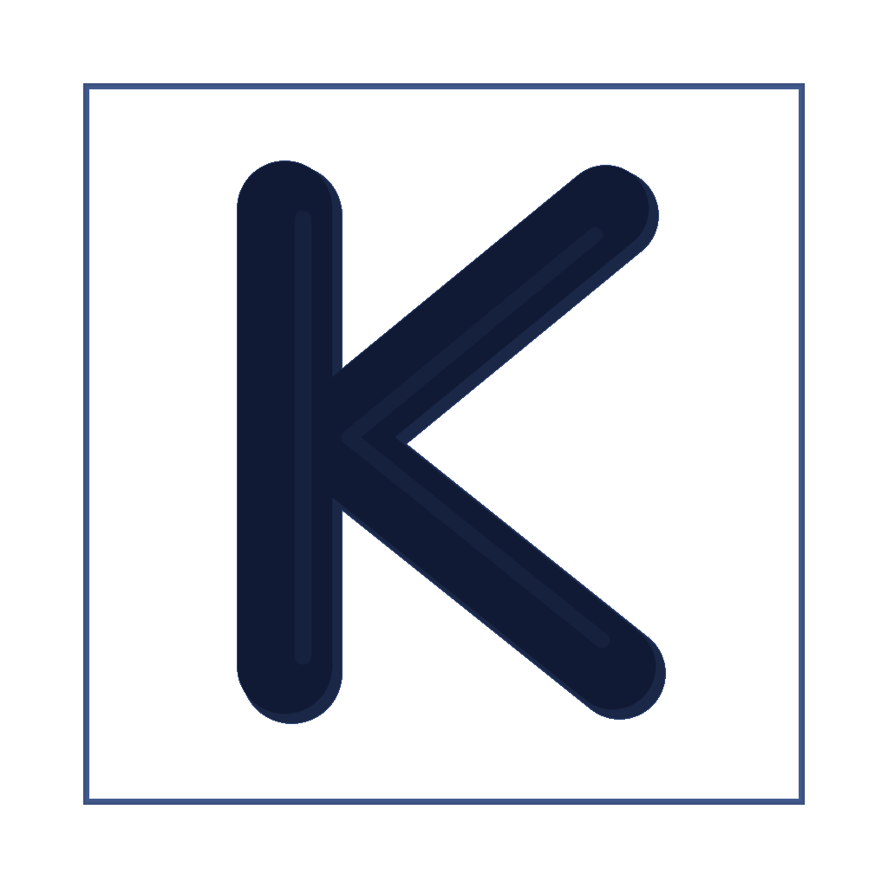

<p align="center">
  
</p>

<h1 align="center">Kubernyx</h1>

<p align="center">
  <strong>A desktop Kubernetes IDE that feels like home.</strong><br/>
  Fast & Focused
</p>

<p align="center">
  
  
  
  
  
</p>

---

## What is Kubernyx?

Kubernyx is a lightweight desktop application for managing Kubernetes clusters. It runs natively on macOS using a WebView, connects through standard kubeconfig files, and gives you everything you need in one window: dashboards, resource browsing, log streaming, container shells, YAML editing, and an integrated kubectl terminal.

No cloud accounts. No subscriptions. No browser tabs. Just point it at your kubeconfig directory and go.

## Features

### 🖥️ Cluster Management

| Feature | Description |
|---------|-------------|
| **Multi-cluster** | Manage all your kubeconfig files from a single directory |
| **Health checks** | Parallel health probes with color-coded status (🟢 🟡 🔴) |
| **Live editing** | Edit kubeconfig YAML directly in the app |
| **Pinned tabs** | Double-click to pin, single-click for preview tabs |

### 📊 Overview Dashboard

Get a bird's-eye view of your cluster the moment you connect:

- **Summary cards** — CPU, memory, pod counts, node status
- **Resource charts** — visual breakdown of usage vs capacity
- **Workload bars** — per-namespace workload distribution
- **Node filter** — switch between master, worker, or all nodes

### ⚙️ Workloads

Full lifecycle management for all major workload types:

| Resource | List | Detail | Logs | YAML Edit | Scale | Restart |
|----------|:----:|:------:|:----:|:---------:|:-----:|:-------:|
| **Pods** | ✅ | ✅ | ✅ | ✅ | — | — |
| **Deployments** | ✅ | ✅ | ✅ | ✅ | ✅ | ✅ |
| **DaemonSets** | ✅ | ✅ | ✅ | ✅ | — | ✅ |
| **StatefulSets** | ✅ | ✅ | ✅ | ✅ | ✅ | ✅ |
| **ReplicaSets** | ✅ | ✅ | ✅ | ✅ | ✅ | — |
| **Jobs** | ✅ | ✅ | ✅ | ✅ | — | — |
| **CronJobs** | ✅ | ✅ | — | ✅ | — | — |

CronJobs also support **manual trigger** and **suspend/resume** controls.

### 🔍 Pod Deep Dive

Click any pod to open a rich detail panel with 7 tabs:

| Tab | What you see |
|-----|-------------|
| **Overview** | Status, conditions, node, IP, QoS class, labels, annotations |
| **Metadata** | Volumes (grouped by type), init containers, tolerations, affinities |
| **Containers** | Resource limits, env vars, volume mounts, ports, image info |
| **Logs** | Real-time streaming with container selector and history loading |
| **Shell** | Interactive exec into running containers |
| **Usages** | Live CPU & memory metrics per container |
| **Manifest** | Raw YAML view of the pod spec |

### 📝 Configuration

| Resource | Features |
|----------|----------|
| **ConfigMaps** | List, inspect key/value data, edit YAML, delete |
| **Secrets** | List, inspect decoded values, edit YAML, delete |

### 🌐 Network

| Resource | Features |
|----------|----------|
| **Services** | Type, ClusterIP, ports, selectors — detail panel with YAML editing |
| **Ingress** | Hosts, paths, backends, TLS — detail panel with YAML editing |

### 🖧 Nodes

- Node list with roles, status, Kubernetes version, OS, kernel, container runtime
- Detail panel showing capacity vs allocatable, addresses, conditions, taints, labels, annotations, and events

### 📅 Events

- Cluster-wide event stream with namespace filtering
- Columns: type, reason, involved object, message, count, first/last seen

### 💻 Integrated Terminal

An IDE-style kubectl terminal lives at the bottom of your screen — just like VS Code:

- **Auto-configured** — `KUBECONFIG` is set to the selected cluster automatically
- **Multi-tab** — open terminals for multiple clusters side by side
- **Tab completion** — press `Tab` to complete kubectl commands, resources, and namespaces
- **Command history** — `↑` / `↓` arrows to navigate previous commands
- **Resizable** — drag the top edge to adjust terminal height
- **Right-click to open** — right-click any cluster → "Open Terminal", or press `Cmd+T`

### 🔎 Namespace Filtering

Each section (Workloads, Config, Network, Events) has its own namespace filter — a searchable multi-select dropdown that remembers your selection per cluster.

### ⌨️ Keyboard Shortcuts

All shortcuts use `Cmd` on macOS and are fully customizable in Settings:

| Shortcut | Action |
|----------|--------|
| `Cmd+W` | Close active detail or terminal tab |
| `Cmd+B` | Toggle sidebar visibility |
| `Cmd+D` | Minimize / restore detail panel |
| `Cmd+T` | Open terminal for active cluster |
| `Escape` | Navigate back or close panels |

---

## Tech Stack

<table>
<tr>
<td width="50%">

### Backend
| | Technology | Purpose |
|-|------------|---------|
|  | **Go 1.23** | Application backend |
| | **Wails v2** | Native WebView bridge |
| | **client-go** | Kubernetes API client |
| | **k8s.io/metrics** | CPU/memory metrics |
| | **sigs.k8s.io/yaml** | Manifest parsing |

</td>
<td width="50%">

### Frontend
| | Technology | Purpose |
|-|------------|---------|
|  | **React 18** | UI framework |
|  | **TypeScript** | Type safety (strict) |
|  | **Vite** | Dev server & bundler |
| | **CSS Custom Props** | Hand-crafted theming |

</td>
</tr>
</table>

**Design choices:**
- **Zero UI library deps** — only React + ReactDOM at runtime. Every component, modal, chart, editor, and animation is hand-written.
- **Native performance** — Wails uses macOS WKWebView, not Electron's bundled Chromium. The app binary is ~15MB, not 200MB+.
- **No external database** — config lives at `~/.kubernyx/config.json`. Kubeconfig files are managed directly on disk.
- **Dark theme** — a carefully crafted dark UI with JetBrains Mono for code, Outfit for UI text, and a deep navy palette with blue-purple accents.

---

## Requirements

| | Requirement | Version | Notes |
|-|-------------|---------|-------|
|  | **Go** | 1.23+ | Backend compilation |
|  | **Node.js** | 18+ | Frontend build tooling |
| | **npm** | 9+ | Dependency management |
| | **Wails CLI** | v2.11+ | `go install github.com/wailsapp/wails/v2/cmd/wails@latest` |
|  | **Xcode CLT** | Latest | macOS native compilation |
| | **kubectl** | Any recent | Required for integrated terminal |

Verify everything is ready:

```bash
wails doctor
```

---

## Getting Started

### 1️⃣ Clone

```bash
git clone https://github.com/your-org/kubernyx-app.git
cd kubernyx-app
```

### 2️⃣ Install dependencies

```bash
cd frontend && npm install && cd ..
```

### 3️⃣ Run in development mode

```bash
make dev
```

This starts the Go backend and Vite dev server together. Frontend hot-reloads instantly. Go changes trigger an automatic rebuild.

### 4️⃣ Build for production

```bash
make build
```

Output: `build/bin/kubernyx.app` — a native macOS application bundle.

```bash
open build/bin/kubernyx.app
```

### 📋 All commands

| Command | What it does |
|---------|-------------|
| `make dev` | Start dev mode with hot-reload |
| `make build` | Production build → `build/bin/kubernyx.app` |
| `make clean` | Async clean of build artifacts |
| `make clean-sync` | Synchronous clean |
| `make clean-deps` | Remove `node_modules` entirely |
| `cd frontend && npx tsc --noEmit` | Type-check frontend |
| `go build ./...` | Compile Go backend only |
| `go test ./...` | Run Go tests |

---

## How to Use

### First Launch

When you open Kubernyx for the first time, it asks you to **select a directory** where your kubeconfig files live. This can be `~/.kube/` or any custom folder. All `.yaml`/`.yml`/`.conf` files in that directory are treated as cluster configs.

### Managing Clusters

The **sidebar** shows all discovered clusters with live health indicators:

- 🟢 **Green** — cluster is reachable and healthy
- 🟡 **Yellow** — cluster is reachable but has issues
- 🔴 **Red** — cluster is unreachable

**Right-click** any cluster for options: Open Terminal, Edit kubeconfig, Delete.

**Click** a cluster to expand its navigation tree:

```
▾ my-cluster          🟢
    Overview
  ▸ Workloads
  ▸ Config
  ▸ Network
    Nodes
    Events
```

### Browsing Resources

1. Select a section from the sidebar tree (e.g., Workloads → Pods)
2. A resource table loads with live data from the cluster
3. **Click** a row to preview its detail panel on the right
4. **Double-click** to pin the detail tab (it won't be replaced)

### Detail Panel

The detail panel slides in from the right with tabbed views (Overview, YAML, Logs, etc.):

- **Drag** the left edge to resize
- **Cmd+D** to minimize/restore
- **Maximize button** to go full-width
- **Cmd+W** to close the active tab

### Editing Resources

Switch to the **YAML** tab in any detail panel to edit manifests. Hit **Save** to apply changes directly to the cluster. Deployments and StatefulSets also have **Scale** and **Restart** controls.

### Using the Terminal

1. **Right-click** a cluster in the sidebar → **Open Terminal** (or press `Cmd+T`)
2. A terminal panel appears at the bottom of the screen
3. Type any kubectl command — `KUBECONFIG` is already set for that cluster
4. Press **Tab** for auto-completion of commands, resource types, and names
5. Open multiple tabs for different clusters

### Settings

Click the **gear icon** (⚙️) in the sidebar footer to:
- Change your kubeconfig directory
- Customize keyboard shortcuts

---

## Project Structure

```
kubernyx-app/
│
├── main.go                    # Wails entry point, window config
├── app.go                     # All exported Go → JS bridge methods
├── wails.json                 # Wails project configuration
├── Makefile                   # Build, dev, clean commands
│
├── internal/
│   ├── config/                # App config (~/.kubernyx/config.json)
│   ├── cluster/               # Cluster CRUD, health checks, kubeconfig paths
│   └── kube/                  # K8s client, resource handlers, streaming,
│                              #   pods, deployments, services, ingress,
│                              #   nodes, events, workload controllers
│
├── frontend/
│   ├── src/
│   │   ├── App.tsx            # Root: layout, tabs, panels, routing
│   │   ├── shared/            # API bindings, types, hooks, utilities
│   │   └── features/
│   │       ├── sidebar/       # Cluster tree, context menu, modals
│   │       ├── overview/      # Dashboard cards, charts, workload bars
│   │       ├── workloads/     # Pods, Deployments, DaemonSets, etc.
│   │       ├── config/        # ConfigMaps, Secrets
│   │       ├── network/       # Services, Ingress
│   │       ├── nodes/         # Node list and detail
│   │       ├── events/        # Cluster event stream
│   │       ├── terminal/      # Integrated kubectl terminal
│   │       └── settings/      # Settings modal, shortcut config
│   └── wailsjs/               # Auto-generated Wails bindings (don't edit)
│
└── build/                     # Build output and app icons
```

---

<p align="center">
  Built with 💙 using <a href="https://wails.io">Wails</a>, <a href="https://go.dev">Go</a>, and <a href="https://react.dev">React</a>
</p>
